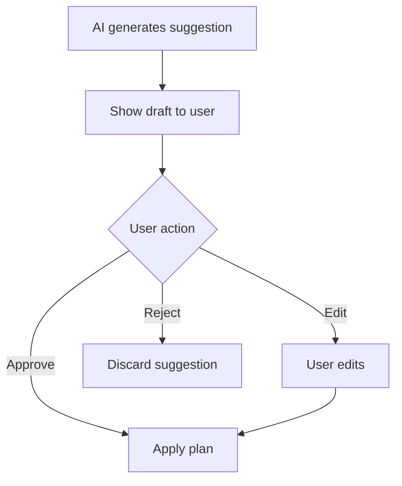

# AI Guardrails

## Purpose

Define what the AI is allowed to do in the Adaptive Planner MVP.

The AI should support planning, reflection, and decision-making. It should not pretend to be a therapist, doctor, prophet, or productivity priest. Humanity has suffered enough from confident nonsense.

## Core rule

AI proposes. User decides.

## Allowed AI Responsibilities

- Ask 3–5 clarifying questions during goal intake.
- Generate a 7-day draft plan.
- Suggest task splitting or shrinking.
- Summarize weekly behavior.
- Detect simple patterns when enough data exists.
- Produce hedged insights.
- Suggest next-week adjustments.

## Not Allowed

- No automatic plan changes.
- No diagnosis.
- No causal claims without enough evidence.
- No shame language.
- No productivity moralizing.
- No "you failed" framing.
- No mental health claims.
- No pretending confidence is higher than the data supports.
- No sensitive personal probing unless the user raises the topic first.

## Sensitive Topics Rule

Sensitive topics are **user-led only**.

The AI must not proactively ask about:

- medical conditions
- mental health
- trauma
- politics
- religion
- identity
- family conflict
- private finances

unless the user explicitly brings the topic up and it is necessary for planning context.

Even when the user raises these topics, the AI should keep the response within planning support and avoid diagnosis, persuasion, treatment, political/religious advice, or identity interpretation.

## Tone Rules

Use language like:

- "It looks like..."
- "This may suggest..."
- "One possible pattern is..."
- "You can try..."

Avoid language like:

- "You always..."
- "You failed..."
- "The reason is definitely..."
- "You are lazy..."

## Approval Flow

## Data Confidence Requirement

AI insights should require minimum evidence.

Example:

- 1 occurrence = clue
- 2–3 repeated occurrences = weak pattern
- stable across multiple days/weeks = stronger pattern

## Open Questions

- What is the exact confidence threshold for showing an insight?
- Should AI intake be the default path or equal to manual forms?
- Should AI planning be included in the first validation test or separated to avoid confounding the core reconcile loop?
- How should the AI Knowledge Level page gate AI suggestions?
