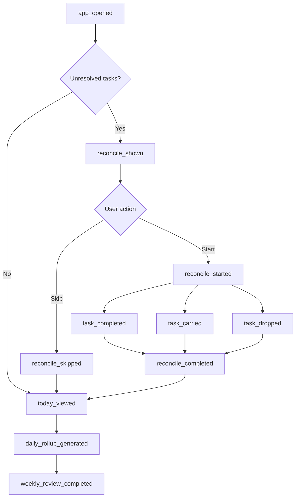

# Event Taxonomy

## Purpose

Define the minimum event schema needed to understand behavior without pretending the system magically knows the user.

The product should rely on observed behavior, not long questionnaires.

## Event List

| Event | Meaning |
|---|---|
| `app_opened` | User opened the app |
| `today_viewed` | User reached the Today page |
| `goal_created` | User created a goal |
| `task_created` | User created a task |
| `task_linked_to_goal` | A task was attached to a goal/project |
| `task_scheduled_for_day` | A task was planned for a specific day, without exact time |
| `task_unscheduled` | A task was removed from a planned day |
| `task_completed` | User marked a task done |
| `task_carried` | User carried a task forward |
| `task_dropped` | User dropped a task |
| `reconcile_shown` | User was shown reconcile after unresolved tasks |
| `reconcile_started` | User entered reconcile flow |
| `reconcile_skipped` | User skipped reconcile after seeing it |
| `reconcile_completed` | User completed reconcile flow |
| `ai_intake_started` | User started conversational goal intake |
| `ai_question_answered` | User answered an AI intake question |
| `ai_plan_generated` | AI generated a draft plan |
| `ai_plan_approved` | User approved the AI plan |
| `ai_plan_edited` | User edited the AI plan |
| `weekly_review_opened` | User opened weekly review |
| `weekly_review_completed` | User completed weekly review |
| `daily_rollup_generated` | System generated daily summary |

## Required Properties

Every event should include:

```json
{
  "id": "event_id",
  "userId": "user_id",
  "type": "task_completed",
  "timestamp": "2026-07-09T00:00:00.000Z",
  "source": "manual | ai_generated | system",
  "entityType": "goal | task | plan | review | app",
  "entityId": "optional_entity_id",
  "metadata": {}
}
```

## Source Tagging

Task source matters because AI planning can become a confound.

Use:

- `manual`
- `ai_generated`
- `system`

## Scheduling Model for MVP

The MVP should only support:

1. goal-linked unscheduled tasks
2. planned-for-day tasks

No exact time-blocking in Phase 1.
No routines in Phase 1.
No deadline-vs-do-date split in Phase 1.

This is still waiting for Claude confirmation in:

- [[01-Open-Discussions/002-ai-planning-reconcile-and-scheduling]]

## Event Flow



## Open Questions

- How much metadata is enough for MVP?
- Should task edits be tracked as separate events?
- Should routines be modeled later as tasks or a separate entity?
- Should deadline and planned day be separate fields later?
