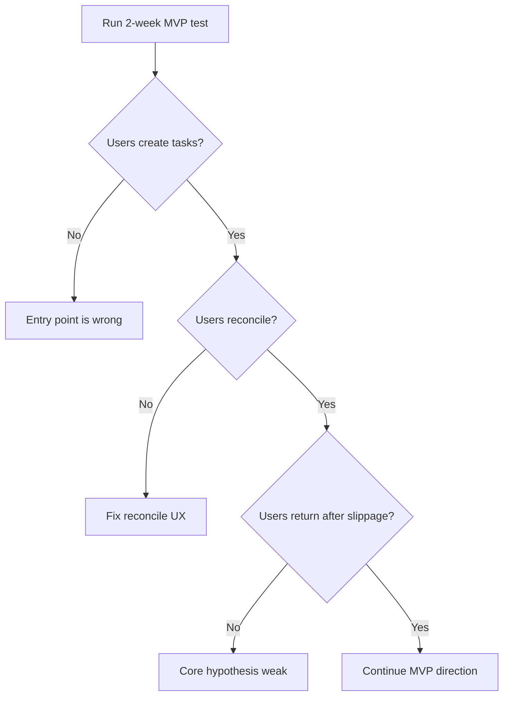

# Traction Metrics

## Purpose

Define what the MVP test must measure.

The goal is not to measure vanity productivity. The goal is to learn whether reconcile-on-open creates return behavior after slippage.

## Primary Metric

### Return After Slippage

Do users come back after failing to complete planned tasks?

This is more important than raw completion rate.

## Core Metrics

| Metric | Meaning |
|---|---|
| D1 retention | User returns the next day |
| D3 retention | User returns within 3 days |
| D7 retention | User returns within 7 days |
| Reconcile completion rate | User finishes reconcile flow after seeing unresolved tasks |
| Carry/drop ratio | Whether users carry everything or make real decisions |
| First action latency | Time from app open to first meaningful action |
| Weekly review completion | Whether users complete the weekly reset |
| Return after absence | Whether users come back after missing multiple days |

## Early Success Thresholds

Draft thresholds for the first test:

- 10–20 testers
- 2-week test window
- 50%+ complete reconcile at least once
- 30%+ return after at least one missed day
- 30%+ complete weekly review
- At least 5 qualitative reports of reduced guilt or clearer restart

These are not final. They are working thresholds, because pretending we know exact numbers before testing would be adorable and useless.

## Decision Tree

## Open Questions

- What is the exact minimum success threshold?
- Should success be measured over 7 calendar days or 7 active days?
- What counts as meaningful return after absence?
