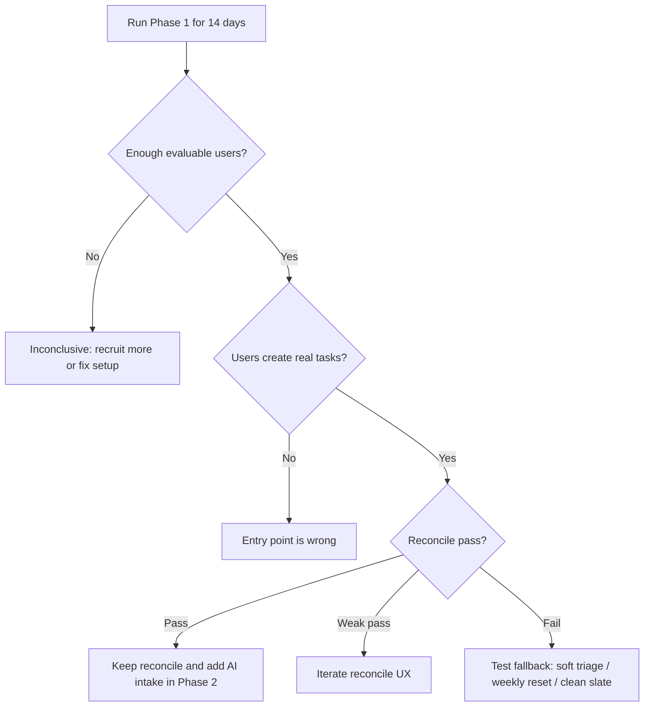

# Traction Metrics

## Purpose

Define what the MVP test must measure.

The goal is not to measure vanity productivity. The goal is to learn whether reconcile-on-open creates return behavior after slippage.

Detailed validation rules live in:

- [[04-Specs/validation-plan]]

## Primary Metric

### Return After Slippage

Do users come back after failing to complete planned tasks?

This is more important than raw completion rate.

## Core Metrics

| Metric | Meaning |
|---|---|
| D1 retention | User returns the next day |
| D3 retention | User returns within 3 days |
| D7 retention | User returns within 7 days |
| Reconcile shown rate | User actually sees reconcile after unresolved tasks |
| Reconcile completion rate | User finishes reconcile flow after seeing unresolved tasks |
| Reconcile skip rate | User skips reconcile after seeing it |
| Skip + meaningful action | User skips reconcile but still does meaningful work shortly after |
| Skip + no action | User skips reconcile and does nothing meaningful shortly after |
| Carry/drop ratio | Whether users carry everything or make real decisions |
| First action latency | Time from app open to first meaningful action |
| Weekly review completion | Whether users complete the weekly reset |
| Return after absence | Whether users come back after missing multiple days |
| Qualitative relief | User reports less guilt, clearer restart, or clearer next action |

## Evaluation Window

Phase 1 test duration:

- 14 calendar days
- 10–20 testers
- manual task entry + reconcile only
- AI-generated planning disabled or hidden from success measurement
- visible AI Knowledge Level meter disabled

## Small Sample Caution

Metrics are directional at this sample size.

With 8 evaluable testers, each user represents 12.5 percentage points. Borderline results must be interpreted with qualitative evidence and observed behavior, not treated as mathematically decisive.

## Evaluable Tester Definition

A tester is evaluable for reconcile only if they:

1. create at least 3 real tasks, and
2. experience at least 1 unresolved task on a later app open.

## Early Success Thresholds

Phase 1 is promising if all of these are true among evaluable testers:

- 60%+ complete reconcile at least once
- 40%+ return after at least one missed day within 48 hours
- median first meaningful action after unresolved-task app open is under 2 minutes
- 30%+ complete weekly review
- at least 5 qualitative reports mention easier restart, less guilt, or clearer next action

## Skip Interpretation

Skip-rate should always be paired with next behavior.

### Skip + meaningful action within 5 minutes

This means reconcile may be friction, but the product still has value.

Possible interpretation:

- user wants to work, but not reconcile right now
- reconcile should be lighter or postponed
- a compact Today banner may be better than a blocking flow

### Skip + no meaningful action

This is more concerning.

Possible interpretation:

- reconcile is actively unwanted
- unresolved task handling feels heavy
- user avoidance remains unsolved

## Weak Pass

Continue iterating if:

- users create tasks and return,
- but reconcile completion is between 35–60%, or
- skip rate is high but users still take meaningful actions elsewhere.

Interpretation:

The core pain may be real, but reconcile may need a softer UX.

## Fail

Reconcile is weak if:

- fewer than 35% of evaluable users complete reconcile, and
- return after slippage is below 25%, and
- qualitative feedback says the flow feels annoying, blocking, or unnecessary.

## Inconclusive

The test is inconclusive if:

- fewer than 8 testers become reconcile-evaluable,
- most testers do not create real tasks,
- or technical/setup issues prevent normal use.

## Decision Tree

## Open Questions

- Should success be measured over exactly 14 calendar days or 7 active days?
- Should qualitative feedback be collected daily or only at the end?
- What is the strongest fallback if reconcile fails?
