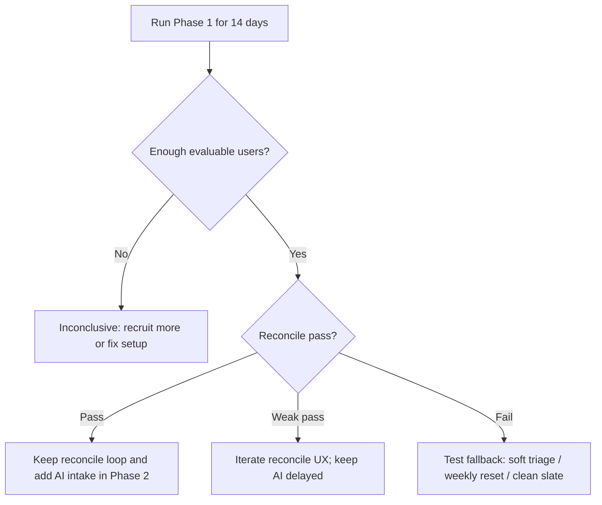

# Validation Plan

## Purpose

Define how the first MVP test decides whether reconcile-on-open is working.

The goal is not to prove the whole Adaptive Life OS vision. The goal is to test one behavioral hypothesis cleanly enough that the next product decision is not guesswork wearing a nice hat.

## Core Hypothesis

Users who fall behind are more likely to return and continue if the product gives them a non-judgmental reconcile flow instead of an overdue guilt pile.

## Validation Strategy

Use sequential validation.

```txt
Phase 1 — Manual planning + Reconcile
Phase 2 — Add AI goal intake for retained users
```

Why:

- AI goal intake is important, but it solves a different problem.
- Reconcile should be tested first without AI plan-generation confounding the result.
- AI should stay in the product map, but validation should be sequenced.

## Test Group

- 10–20 testers
- target: developers / solo builders / technical students / freelancers
- must have abandoned at least one planning tool before
- must create real tasks for real projects, not fake test data

## Phase 1 — Manual + Reconcile

### Duration

14 calendar days.

### Features enabled

- manual goal/task entry
- Today page
- planned-for-day tasks
- reconcile-on-open
- Done / Carry / Drop
- skippable reconcile
- weekly review
- event log
- daily rollup

### Features disabled or hidden

- AI-generated 7-day draft planning
- full AI personalization suggestions
- routines
- time-blocking
- calendar integration

AI may still exist for copy/support if needed, but AI plan generation should not be part of Phase 1 success measurement.

## Reconcile Exposure Definition

A tester becomes evaluable for reconcile only after they have:

1. created at least 3 real tasks, and
2. had at least 1 unresolved task appear on a later app open.

Without this exposure, we cannot judge reconcile. Stunningly, a feature cannot be evaluated by users who never saw it. Science survives another day.

## Success Metrics

### Primary Success Metric

Return After Slippage.

A tester counts as returning after slippage if:

- they had unresolved tasks, and
- they opened the app again within 48 hours, and
- they took a meaningful action.

Meaningful actions:

- complete reconcile
- mark a task done
- carry a task
- drop a task
- create a smaller replacement task
- complete weekly review

### Secondary Metrics

| Metric | Success Signal |
|---|---|
| Reconcile completion rate | User completes reconcile after seeing unresolved tasks |
| Reconcile skip rate | User skips reconcile instead of entering it |
| Return after missed day | User comes back after at least one missed day |
| First action latency | User takes first meaningful action quickly after app open |
| Carry/drop ratio | User makes real decisions instead of carrying everything forever |
| Weekly review completion | User completes the end-of-week review |
| Qualitative relief | User reports clearer restart / less guilt / less clutter |

## Pass / Fail / Inconclusive Criteria

### Pass

Phase 1 is considered promising if all of these are true among evaluable testers:

- 60%+ complete reconcile at least once
- 40%+ return after at least one missed day within 48 hours
- median first meaningful action after unresolved-task app open is under 2 minutes
- 30%+ complete weekly review
- at least 5 qualitative reports mention easier restart, less guilt, or clearer next action

### Weak Pass

Continue iterating if:

- users create tasks and return,
- but reconcile completion is between 35–60%, or
- skip rate is high but users still take meaningful actions elsewhere.

Interpretation:

The problem may be real, but the reconcile UX may be too heavy.

### Fail

Reconcile is considered weak if:

- fewer than 35% of evaluable users complete reconcile, and
- return after slippage is below 25%, and
- qualitative feedback says the flow feels annoying, blocking, or unnecessary.

### Inconclusive

The test is inconclusive if:

- fewer than 8 testers become reconcile-evaluable,
- most testers do not create real tasks,
- or technical/setup issues prevent normal use.

Do not make product conclusions from a broken test. Apparently this needs to be written down, because humans keep doing it.

## Reconcile Must Be Skippable

Reconcile should be strongly suggested but not mandatory.

Events to track:

- `reconcile_shown`
- `reconcile_started`
- `reconcile_skipped`
- `reconcile_completed`

High skip rate is not just failure. It is a signal.

Possible interpretations:

- reconcile appears too often
- copy feels too heavy
- user wants a clean Today page first
- weekly-only reset may fit better
- AI-assisted triage may be needed

## Decision After Phase 1



## Phase 2 — Add AI Goal Intake

Only start Phase 2 after Phase 1 has a pass or weak pass.

Phase 2 tests:

- whether AI intake reduces goal-to-task friction
- whether AI-generated tasks survive reconcile better or worse than manual tasks
- whether users approve/edit/reject AI plans

Required tagging:

- `manual`
- `ai_generated`
- `system`

## Open Questions

- Should Phase 1 be exactly 14 calendar days or 7 active days?
- What is the minimum tester quality bar?
- Should qualitative feedback be collected daily or only at the end?
- What is the strongest fallback if reconcile fails?
