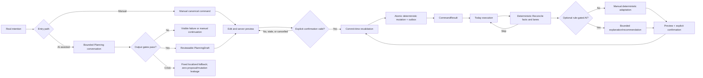

# AI-Native MVP Core Loop

## Status

`REWRITTEN — CURRENT FLOW PROJECTION`

## Invariants

- AI output is never permission or canonical state.
- Today never blocks on Reconcile.
- Invalid/partial output creates no reviewable resource.
- Manual and deterministic paths remain available.
- Every consequence is previewed, confirmed, revalidated, committed atomically, and evidenced.

Authority: [[04-Specs/ai-native-mvp-baseline]] and Discussions 010–020B.
