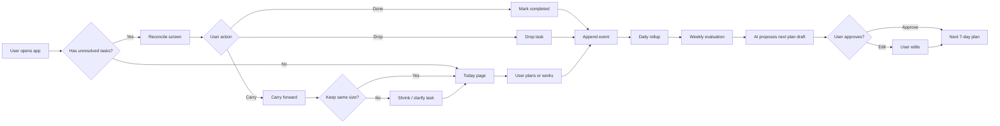

# MVP Core Loop

This file converts the FigJam MVP flow into a maintainable Mermaid flowchart.

## Core loop

## Product meaning

The first product bet is not "AI creates a perfect plan".

The first product bet is:

> If users can reconcile unfinished work without shame, they are more likely to return after slippage instead of abandoning the planner.

## Locked behavior

- No red overdue guilt wall.
- No streak-first design.
- No automatic AI plan application.
- AI drafts only.
- User approves changes.
- Append-only event log.
