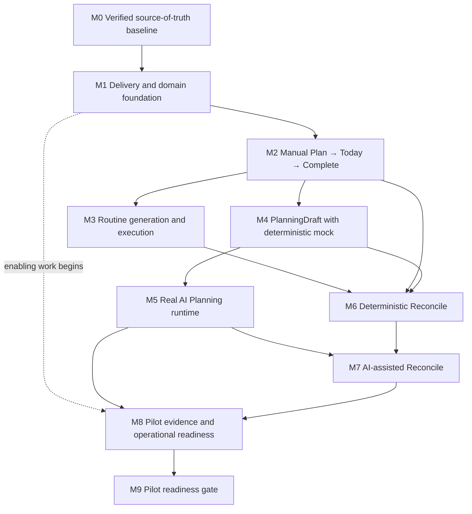

# AI-Native MVP Dependency Graph

## Status

`WORKSTREAM_I_APPROVED — 2026-07-22`

## Governing dependency

Routine domain design may begin after M1, but the integrated M3 milestone depends on M2's Today surface. M3 and M4 may then proceed in parallel after M2. M8 enabling work begins at M1; M8 exit depends on M5 and M7 producing the real runtime/evidence surfaces.

## Contract dependencies

| Producer | Contract/output | Consumers | Required lock |
|---|---|---|---|
| M1 | auth/ownership, IDs, versions, Problem Details, transactions, outbox, event envelope | all later milestones | `SLICE_LOCKED` before M2 integration |
| M2 | Task command, Today projection, CommandResult, completion events | M4, M6, M8 | `SLICE_LOCKED` at M2 integration |
| M3 | Routine/RoutineOccurrence identity, local-date generation and resolution | M6, M8 | `SLICE_LOCKED` at M3 integration |
| M4 | Attempt/Draft/revision/confirmation states and deterministic fixtures | M5, M6, frontend consumers | `SLICE_LOCKED` before real provider work |
| M5 | runtime ports, context manifest, artifact identity, failure/cost controls | M7, M8, M9 | runtime bundle locked for each evaluation |
| M6 | fact catalog, severity classifier, rule/reason codes, ReconcileSession | M7, M8 | classifier/rules version locked before outcome collection |
| M7 | explanation/recommendation resources and disposition/application evidence | M8, M9 | `PILOT_LOCKED` before pilot |
| M8 | metric dictionary, denominator map, dashboards, runbooks, drills | M9 | `PILOT_LOCKED` |

## Cross-cutting dependencies

- Safety and privacy review begin with schema/context design, not after AI integration.
- Event names and required fields lock before a producing feature is complete.
- Frontend may use mocks only against the same versioned contract backend will implement.
- Database constraints and command invariants must exist before UI success paths are accepted.
- Manual paths precede or accompany every AI-dependent path.
- Crisis resources, restricted-event rules, and zero-leakage behavior block real-user AI exposure.

## Blocking external/configuration dependencies

| Package | First blocking point |
|---|---|
| supported framework/database/container versions | M1 slice lock |
| OTP/JWT/SMS values and provider | production auth gate |
| schema/migration numbering and rollback | M1 exit |
| provider/model/artifact and spend limits | M5 real-provider enablement |
| localized crisis resources/corpus/sign-offs | M5 real-user testing and M9 |
| retention/legal/access schedule | data collection and M9 |
| pilot cohort/consent/threshold lock | M9 |

Authority: [[01-Closed-Discussions/022-updated-mvp-implementation-plan]], [[04-Specs/ai-native-mvp-baseline]], and [[05-Implementation/implementation-reuse-and-supersession-matrix]].
